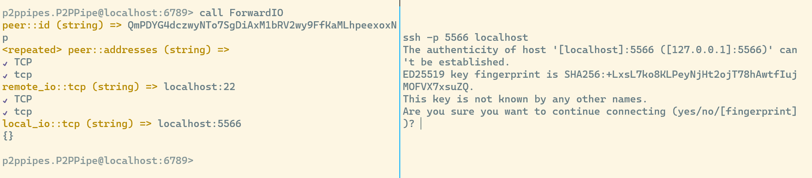

# Tutorial on how to forward traffic

The following shows how to run two nodes, and how to discover the nodes with grpc services calling,
how to open a stream between them, and forward traffic on one nodes to remote socket on another.

## Host bootstrapping nodes

Although it is our intention to make go-p2p-pipes work over "public" libp2p network
(the network to which the default bootstrapping nodes belong),
go-p2p-pipes works beth with "private" libp2p network. 
You can host an isolated small network by hosting some private bootstrapping nodes.

TODO: also with different protocol prefix https://pkg.go.dev/github.com/libp2p/go-libp2p-kad-dht#ProtocolPrefix

Your may [go-libp2p-daemon](https://github.com/libp2p/go-libp2p-daemon), [server at rust-libp2p](https://github.com/libp2p/rust-libp2p/tree/master/misc/server) or [p2ppipesd](../cmd/p2ppipesd) in this repo to start a new server.

TODO: show how to save private key file and find out the peer ID.

For example, you may run `p2ppipesd` with
```
./p2ppipesd --dhtserver --nodefaultbootstrappeers --hostaddrs /ip4/0.0.0.0/tcp/18445
```
From now on, we assume this bootstrapping nodes's multiaddr is `/ip4/127.0.0.1/tcp/18444/p2p/12D3KooWDydFKqzr4Wxin7MLQWW83Uzp8itJJxa1EbwfkBQrHydh`.

## Start the daemon

Start two other nodes that are going to connect eaching other by

```
p2ppipesd --dhtserver --bootstrappeers /ip4/127.0.0.1/tcp/18444/p2p/12D3KooWDydFKqzr4Wxin7MLQWW83Uzp8itJJxa1EbwfkBQrHydh --listeningaddr 127.0.0.1:6780 --hostaddrs /ip4/0.0.0.0/tcp/18446
```

and

```
p2ppipesd --dhtserver --bootstrappeers /ip4/127.0.0.1/tcp/18444/p2p/12D3KooWDydFKqzr4Wxin7MLQWW83Uzp8itJJxa1EbwfkBQrHydh --listeningaddr 127.0.0.1:6789 --hostaddrs /ip4/0.0.0.0/tcp/18445
```

If nodes running p2ppipesd are behind NAT. You may also specify `--autorelaypeers /ip4/a.b.c.d/tcp/18444/p2p/12D3KooWDydFKqzr4Wxin7MLQWW83Uzp8itJJxa1EbwfkBQrHydh` 
to connect to nodes via [libp2p Circuit Relay](https://docs.libp2p.io/concepts/nat/circuit-relay/).
`--holepunching` is also useful in this case. Libp2p will then try to automatically punch a hole. If that succeeded,
direct connection between peers would then be established.

Here the `--listeningaddr` parameter is used to specify the socket address which the gRPC server is going to listening on.
All the RPC methods can be seen from [the proto file](../pb/p2ppipes.proto).

## Discover peers

Because of how kademlia (the underlying dht algorithm for [go-libp2p-kad-dht](https://github.com/libp2p/go-libp2p-kad-dht/)) works,
there is a chance that these two nodes have learned each other once they bootstrapped their dht network.
If this is not the case, we need to make they find each other by providing the same rendezvous point, and
finds out all the peers providing this rendezvous point.

TODO: improve the program p2ppipesc, and get ride of grpcurl or evans below.

Calling gRPC services with the following commands (we use [grpcurl](https://github.com/fullstorydev/grpcurl) to call gRPC methods) to start discover.

```
grpcurl -plaintext -proto ./pb/p2ppipes.proto -format json -d '{"method": "DHT", "dht": {"rv": "abc"}}' localhost:6780 p2ppipes.P2PPipe.StartDiscoveringPeers
```

```
grpcurl -plaintext -proto ./pb/p2ppipes.proto -format json -d '{"method": "DHT", "dht": {"rv": "abc"}}' localhost:6789 p2ppipes.P2PPipe.StartDiscoveringPeers
```

Here the parameter `"abc"` is the rendezvous point with which different peers can discover each other. We should 
use a different rendezvous point for different networks.

## List all the peers discovered

After peers has broadcasted their identity to the network, we can run

```
grpcurl -plaintext -proto ./pb/p2ppipes.proto -format json -d '{"method": "DHT", "dht": {"rv": "abc"}}' localhost:6780 p2ppipes.P2PPipe.ListDiscoveredPeers
```

to obtain a list of all the peers that has the same rendezvous point.
Note that there is a cache mechanism in finding all the peers with the same rendezvous point, so there
may be some outdated peers appearing (or some new peers missing) in the peer list.

Here is a sample output of the above command.

```
    {
      "id": "QmPDYG4dczwyNTo7SgDiAxM1bRV2wy9FfKaMLhpeexoxNp",
      "addresses": [
        "/ip4/a.b.c.d/tcp/18444/p2p/12D3KooWDydFKqzr4Wxin7MLQWW83Uzp8itJJxa1EbwfkBQrHydh/p2p-circuit",
        "/ip4/127.0.0.1/tcp/18446",
        "/ip4/192.168.221.214/tcp/18446"
      ]
    },
    {
      "id": "QmTrSME55fvdWYVZhJTTYbDD85XMmnJDXDwcGuYxVNJmBg",
      "addresses": [
        "/ip4/192.168.52.20/tcp/18445",
        "/ip4/a.b.c.d/tcp/18444/p2p/12D3KooWDydFKqzr4Wxin7MLQWW83Uzp8itJJxa1EbwfkBQrHydh/p2p-circuit",
        "/ip4/127.0.0.1/tcp/18445"
      ]
    }
```

Note that we have found loopback, LAN and relay addresses for the discovered peers.
Here `"/ip4/a.b.c.d/tcp/18444/p2p/12D3KooWDydFKqzr4Wxin7MLQWW83Uzp8itJJxa1EbwfkBQrHydh/p2p-circuit"`
and `"/ip4/a.b.c.d/tcp/18444/p2p/12D3KooWDydFKqzr4Wxin7MLQWW83Uzp8itJJxa1EbwfkBQrHydh/p2p-circuit"`
are two relay addresses. We can reach peers behind NAT by these addresses.
Moreover, libp2p can use this addresses to punch a hole in the NAT if the `--holepunching` flag is specified.

## Request to forward

Again, this is done by calling a gRPC method provided by the daemons. See the [the proto file](../pb/p2ppipes.proto) for details.

TODO: take a screenshot of hole punching actually works.

Below is a screenshot that shows how to port forwarding from localhost:5566 to localhost:22 via libp2p streams works
(this is a rather silly example). The panel on the left side shows how I issued the port forwarding
RPC with [evans](https://github.com/ktr0731/evans/tree/d1bc03aba033885771527149192dc67948908237),
while the panel on the right side shows it worked.



The equivalent grpcurl command is
```
grpcurl -plaintext -proto ./pb/p2ppipes.proto -format json -d '{"peer":{"id":"QmPDYG4dczwyNTo7SgDiAxM1bRV2wy9FfKaMLhpeexoxNp"},"remote_io":{"io_type":2,"tcp":"127.0.0.1:22"},"local_io":{"io_type":2,"tcp":"127.0.0.1:5566"}}' localhost:6789 p2ppipes.P2PPipe.StartForwardingIO
```
